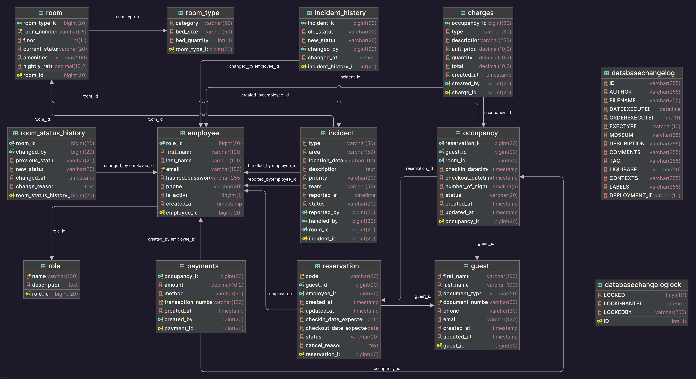

# 🏨 Sistema de Gestión Integral para Hotel Imperial

Proyecto académico desarrollado por estudiantes de la **Escuela Académico Profesional de Ingeniería de Sistemas e Informática** de la **Universidad Continental**.

---

## 📌 Integrantes del Equipo

| APELLIDOS Y NOMBRES               | CÓDIGO   |
|----------------------------------|-----------|
| **Castro Verastegui Juan Alejandro** | 71388098 |
| **Pariona Inga Logan Yoshua Leonardo** | 72508579 |
| **Quispe Medina Willy Alexander** | 76990858 |

---

## 📝 Descripción del Proyecto

El **Sistema de Gestión Integral para Hotel Imperial** es una solución tecnológica diseñada para optimizar la gestión operativa del hotel, abarcando procesos misionales, estratégicos y de soporte.  

El sistema integra módulos para la **gestión de reservas, habitaciones, limpieza, mantenimiento, análisis predictivo y reportes ejecutivos**, utilizando tecnologías modernas como **Spring Boot, React, PostgreSQL y Machine Learning**.

---

## 🚀 Características Principales

- **Gestión de Habitaciones y Reservas:** Control en tiempo real del estado de las habitaciones y reservas.  
- **Dashboard Ejecutivo:** Visualización de métricas clave como ocupación, ingresos y KPIs.  
- **Sistema de Notificaciones:** Comunicación entre recepción, limpieza y mantenimiento.  
- **Gestión de Incidencias:** Registro y seguimiento de incidencias y tareas de mantenimiento.  

---

## 🛠 Stack Tecnológico

### **Frontend**
- React con TypeScript  
- Tailwind CSS para estilos  
- Vite como bundler  
- Axios para peticiones HTTP  

### **Backend**
- Java 21 con Spring Boot 3.5.4  
- Spring Security para autenticación y autorización  
- Spring Data JPA para persistencia de datos  
- PostgreSQL como base de datos  
- Flyway para migraciones  
- JWT para autenticación  

### **Machine Learning**
- Scikit-learn para modelos predictivos  
- Python para análisis de datos  

### **DevOps**
- Git y GitHub para control de versiones  
- Docker para contenedores (opcional)  
- Postman / Insomnia para pruebas de API  

---

## 📂 Estructura del Proyecto

### **Frontend**
```
src/
├── layouts/
│ └── GeneralLayout.tsx
├── pages/
│ ├── estrategicos/
│ │ └── planificacion-estrategica/
│ │ ├── components/
│ │ └── views/
│ ├── misionales/
│ │ ├── gestion-habitaciones/
│ │ │ ├── components/
│ │ │ └── views/
│ │ ├── gestion-reservas/
│ │ │ ├── components/
│ │ │ └── views/
│ │ └── views/
│ └── soporte/
│ ├── gestion-incidencias/
│ │ ├── components/
│ │ └── views/
│ └── views/
└── App.tsx
```
### **Backend**´
```
src/
├── main/
│ ├── java/com/imperial/hotel/
│ │ ├── application/
│ │ │ ├── guest/
│ │ │ ├── incident/
│ │ │ ├── reservation/
│ │ │ └── room/
│ │ ├── domain/
│ │ │ ├── guest/
│ │ │ ├── incident/
│ │ │ ├── reservation/
│ │ │ └── room/
│ │ └── infrastructure/
│ │ ├── config/
│ │ ├── jpa/
│ │ ├── security/
│ │ └── web/
│ └── resources/
│ ├── db/
│ │ ├── changelog/
│ │ └── migration/
│ └── application*.yml
└── test/
```

---

## 📋 Requisitos Previos

- Java 21 o superior  
- Node.js 18+ y npm/yarn  
- PostgreSQL 13+  
- Maven 3.8+  


---

## 📊 Base de Datos

El proyecto utiliza **PostgreSQL** con migraciones gestionadas por **Flyway**.

### 🗃️ Tablas principales
- `users`, `roles`: Gestión de usuarios y roles.  
- `rooms`, `room_status_history`: Gestión de habitaciones e historial.  
- `reservations`: Gestión de reservas.  
- `incidents`: Registro de incidencias.  

---

## 📈 Diagrama Entidad–Relación (ERD)

El diseño de la base de datos se representa en el siguiente diagrama ER:


---

## 🔒 Seguridad

- **Autenticación JWT:** Tokens con expiración para acceso seguro.  
- **Roles:** Recepcionista, Personal de Servicio, Gerente.  
- **Encriptación:** Contraseñas almacenadas con **Bcrypt**.  


